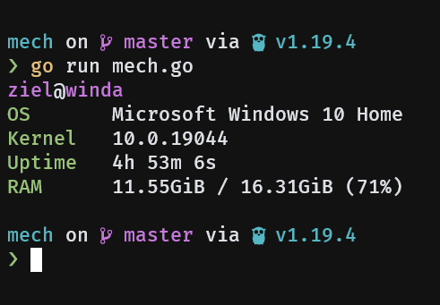
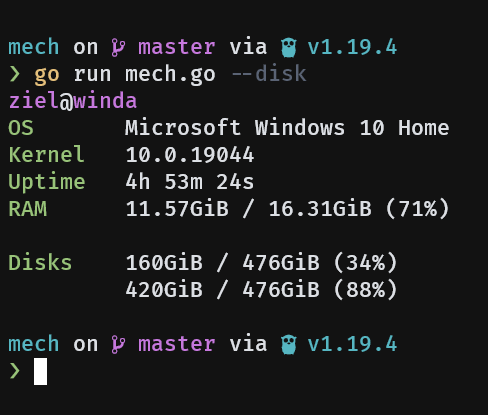
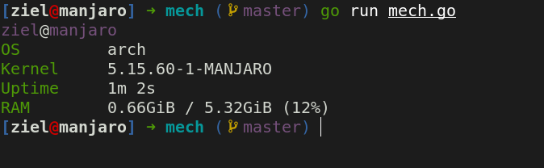
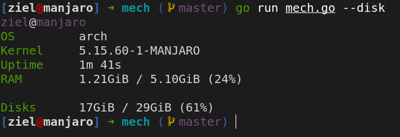

# Mech

## Simple system information tool in GoLang

## Quick setup

Run mech

```shell
$ go run mech.go
```

Or with disks

```shell
$ go run mech.go --disk
```

## Gallery

### Windows



<details>
<summary>With disks</summary>

</details>

### Linux



<details>
<summary>With disks</summary>

</details>


## TODO

- [x] - Add some pretty printing / align text
- [x] - Add a good looking screenshot
- [ ] - Installation script so you can use it everywhere
  - [ ] - Windows
  - [x] - Linux

## License

This project is under the [MIT](./LICENSE) license.